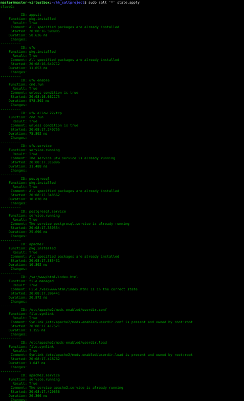
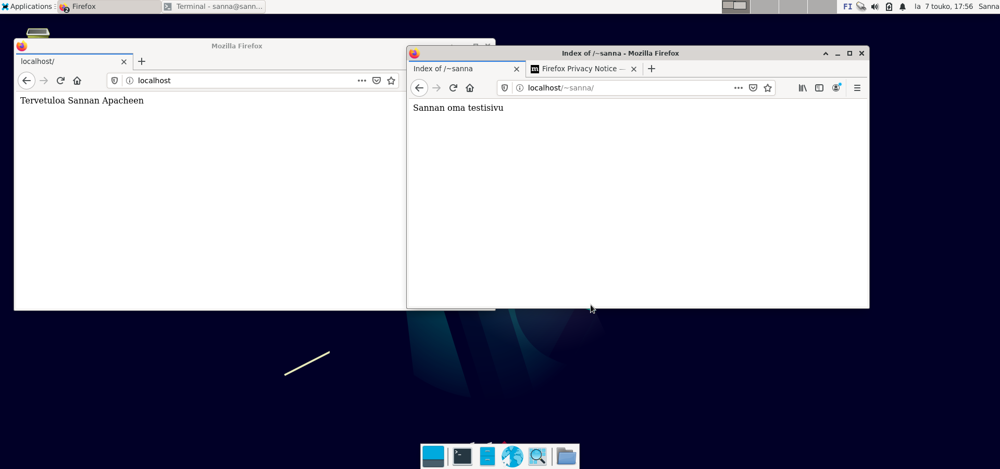

## Django ympäristö Saltilla
Moduulin tarkoitus: Asentaa ympäristö Django-webbisovelluksen kehittämiseen Linux-palvelimille. 

Toteuttaja: Sanna Jyrinki

### Suunnitelma lopulliselle versiolle
- tuotantoserveri:
  - appikset: hyödyllisiä pikkuohjelmia micro, bash-completion, pwgen, tree
  - palomuuri: ufw palomuurin, asennus, enablointi ja avaus ssh ja apache portille
  - apache asennus, testisivu ja käyttäjän kotisivu
  - django tuotantoasennus
  - testisovellus, jolla toiminta voidaan demota
- jatkokehitysehdotuksia, joita ei keretty toteuttaa
  - kehitysserveri, jossa django asennetaan kehitysserverinä
  - postgressql ja sen käyttöönotto djangossa vakiona olevan sqllite3:n sijaan

Moduulin lisenssi: GPL2

Kypsyysaste: Beta

Latauslinkki: https://github.com/jyrinsan/hh_saltproject/tree/master/srv/salt

### Beta-versio

Moduulin ajo monta kertaa peräkkäin osoittaa sen olevan idempotentti eli muutoksia ei tapahdu kun mitään ei ole muutettu

### Alpha-versio
- micro tekstieditori
- ufw palomuuri, enablointi ja avaus ssh portille
- apache asennus, testisivu ja käyttäjän kotisivu

### Lähteet

- Djangocentral. n.a. Luettavissa [Using PostgreSQL with Django](https://djangocentral.com/using-postgresql-with-django/). Luettu 15.5.2022.
- Karvinen, T. 2022a. Luettavissa [Configuration management systems 2022](https://terokarvinen.com/2021/configuration-management-systems-2022-spring/#arviointi). Luettu 03-05/22.
- Karvinen, T. 2022b. [Django 4 Instant Customer Database Tutorial](https://terokarvinen.com/2022/django-instant-crm-tutorial/). Luettu 14-15.5.2022.
- Karvinen, T. 2022c. [Deploy Django 4 - Production Install](https://terokarvinen.com/2022/deploy-django/?fromSearch=django). Luettu 14-15.5.2022.
